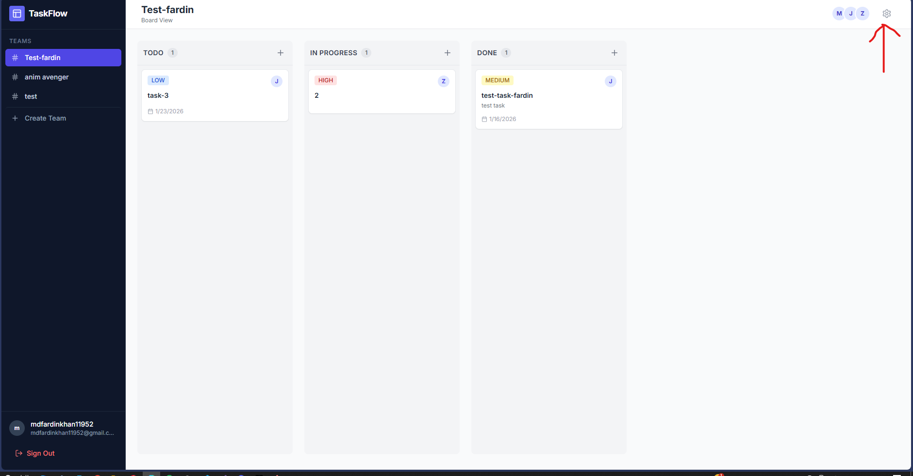

# TaskFlow

**A Real-time, Jira-inspired Collaborative Task Management System.**

TaskFlow is a modern SaaS platform designed for agile teams to track workflows, manage projects, and collaborate in real-time. Built using the **MERN** stack (MongoDB, Express, React, Node.js), it creates a seamless, app-like experience within the browser.

## 🚀 Architectural Philosophy: The Team-Centric Model

TaskFlow adopts a scalable, **Team-Centric Permission Model** (similar to Slack, Asana, or Jira Cloud), rather than a rigid global hierarchy.

### How it Works:
1.  **Unified Identity**: A user creates a single account (Global Identity). This account exists independently of any specific organization or team.
2.  **Contextual Roles**: Roles are **scoped strictly to the Team level**, not the application level.
    *   **Team Owner**: Any user can create a new Team. The creator automatically becomes the **Owner** of that specific workspace. They have full control (add/remove members, delete team).
    *   **Member**: A user can be invited to join other teams. In those contexts, they are strictly a **Member** with read/write access to tasks but no administrative privileges over the team itself.
3.  **Flexibility**: A single user can be the **Owner** of "Engineering Team" while simultaneously being a **Member** of "Marketing Team".

This approach allows for organic growth, multi-tenancy, and high scalability without requiring a central "Super Admin" to provision every workspace.

## ✨ Key Features

*   **Real-Time Collaboration**: Updates to tasks, columns, and team membership flow instantly to all connected clients via **Socket.IO**.
*   **Kanban Board**: Drag-and-drop interface for managing task status (Todo, In Progress, Done).
*   **Team Management**: dynamic member invites, role management, and team switching.
*   **Reactive UI**: Built with React 18, Redux Toolkit, and optimistic UI updates for a snappy feel.
*   **Secure Authentication**: JWT-based stateless authentication with automatic token refreshing.

## 🛠 Technology Stack

### Frontend
*   **React 18**: Component-based UI library.
*   **Redux Toolkit**: State management for predictable data flow.
*   **TypeScript**: Static typing for robustness and maintainability.
*   **Tailwind CSS**: Utility-first CSS framework for rapid styling.
*   **Socket.IO Client**: For bi-directional event-based communication.
*   **React Router v6**: Client-side routing.

### Backend (API)
The frontend connects to a remote REST/WebSocket API (hosted at render) which implements:
*   **Express**: Progressive Node.js framework.
*   **MongoDB**: NoSQL database for flexible data schemas (Tasks, Users, Teams).
*   **Socket.IO Gateway**: Handling real-time event broadcasting.

## 📦 Installation & Setup

1.  **Clone the repository**
    ```bash
    git clone https://github.com/yourusername/taskflow.git
    cd taskflow
    ```

2.  **Install Dependencies**
    ```bash
    pnpm install
    ```

3.  **Run Development Server**
    ```bash
    pnpm dev
    ```
    The app will run at `http://localhost:3000` (or the port configured by your bundler).

## 🧪 Testing the Real-Time Logic

To experience the collaborative nature of TaskFlow:

1.  Open **Browser Window A** and log in (or register) as User 1.
2.  Create a team called (“Alpha Squad”), then click the icon indicated in the image.

3.  Open **Browser Window B** (Incognito/Private) and register as User 2.
4.  In Window A, add User 2 to "Alpha Squad".
5.  *Watch as the team instantly appears in Window B's sidebar.*
6.  Drag a task in Window A; observe it move instantly in Window B.


